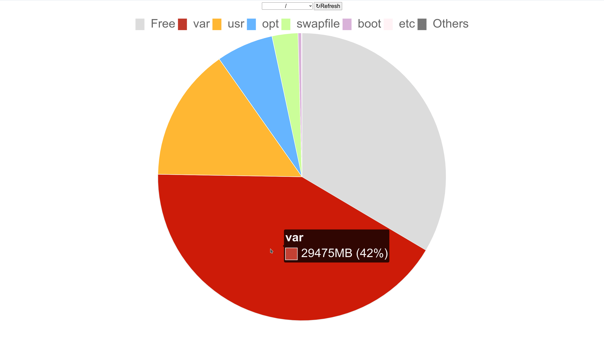

# Diskchart
### disk usage with piechart on a browser

Diskchart is a docker image that enables us to visualize disk space usage from any system.




#### Running

Example for running diskchart with *docker run* command:
```
sudo docker run --name diskchart --env=BINDINGS='{"/": "/mnt/main", "/home": "/mnt/home"}' --volume=/:/mnt/main --volume=/home:/mnt/home -p 1024:80 -d leandrocm86/diskchart:latest
```

The initial folders must be informed in the environment variable called **BINDINGS** and be mounted when starting the container. From these chosen starting points we can see how the space is being used in total or in each of their subfolders.

The BINDINGS variable must be a key-value dictionary in JSON format, showing each mounted volume by its respective label to be displayed. In the example above, we mounted the root partition (/) on */mnt/main*, and /home on */mnt/home*.

Diskchart renders the piechart on container's port 80, and exposing it is the only thing needed besides mounting the volumes and defining them on the BINDINGS variable. In the example above, we exposed diskchart on port 1024.

PS: Although the target folders may be mounted anywhere inside the container, it's advisable to mount them inside /mnt to avoid conflicts with existing folders in the container.

When it's up and running, simply access the host from a browser on the defined port (ex: http://localhost:1024).


#### docker-compose (optional)

If you prefer using a compose file instead of running the container manually, there's a [docker-compose.yml](docker-compose.yml) example in the project's root folder. Just update the volumes section and the BINDINGS variable with your volumes information.


#### About

Diskchart is a very small and simple project, using a minimalist Alpine image with Python installed for running a backend API that provides the information about the mounted volumes. The front-end runs on Nginx and uses *chart.js* to create the chart.